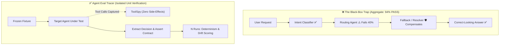
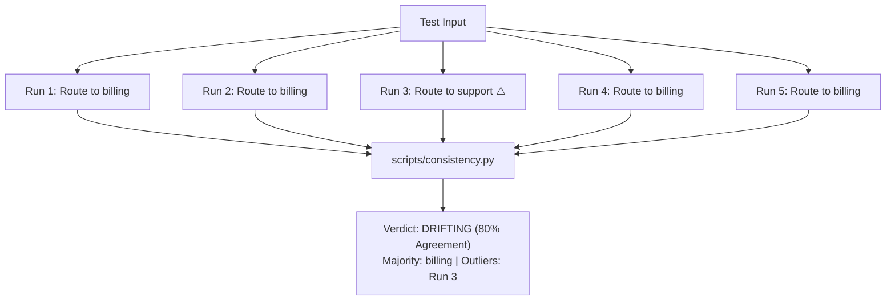

# 🔬 Agent Eval Tracer

<p align="center">
  <strong>Precision isolated testing, statistical consistency analysis, and deep memory retention benchmarking for multi-agent AI architectures.</strong>
</p>

<p align="center">
  <a href="#-the-problem-the-masking-dilemma"></a>
  <a href="#-why-agent-eval-tracer"></a>
  <a href="#-planted-fact-memory-testing"></a>
  <a href="#-quick-start"></a>
  <a href="#-zero-dependencies"></a>
</p>

---

## ⚡ The Problem: The "Masking" Dilemma

> [!CAUTION]
> **End-to-End Pass Rates Lie.**
> In multi-agent pipelines, a single agent or sub-layer (e.g., routing, escalation, context summarization) can be completely broken while your aggregate system score reads a pristine **95% PASS**.

Other layers quietly compensate, short test cases never trigger edge conditions, and active prompts keep facts visible so memory bugs never surface. Aggregate metrics tell you *if* a regression occurred, but never **where** or **why**.



**Agent Eval Tracer** shifts the unit of evaluation from the opaque pipeline to the **individual agent in isolation**.

---

## 💡 Why Agent Eval Tracer?

| Challenge in Agent Systems | Traditional E2E Testing | Agent Eval Tracer Approach |
| :--- | :--- | :--- |
| **Fault Localization** | ❌ "Something failed in the 5-agent pipeline." | ✅ Pinpoints exact agent, prompt fork, or tool call deviation. |
| **Silent Masking** | ❌ Downstream agents cover up upstream logic errors. | ✅ Tests each layer against frozen upstream inputs. |
| **Hallucination Detection** | ❌ Single run looks plausible and passes. | ✅ Repeats runs $N$ times to measure statistical drift & stability. |
| **Memory Eviction** | ❌ Short test cases keep context in active window. | ✅ Buries planted facts beyond context limits against summarized memory. |
| **Test Execution Cost** | ❌ Expensive full-chain LLM calls for every test. | ✅ Fast, deterministic, no-LLM contract tests wherever possible. |
| **Safety & Side Effects** | ❌ Risk of polluting production DBs or hitting external APIs. | ✅ `ToolSpy` intercepts all side-effects and logs intended actions. |

---

## 🏗️ Core Evaluation Pillars

### 1. 🛡️ Side-Effect Free Isolation
Test agents independently without touching live infrastructure:
- **`ToolSpy`:** Intercepts database writes, API mutations, and external calls. Asserts on agent intent while returning canned responses.
- **Frozen Inputs:** Eliminates upstream flakiness by providing fixed, deterministic input fixtures.
- **Scratch Stores:** Ephemeral memory state isolation to prevent cross-test contamination.

### 2. 🎲 Consistency & Hallucination Profiling
Hallucinations are inherently unstable. Running inputs across two distinct regimes surfaces latent fragility:
- **Determinism Check (`temperature = 0.0`):** Any divergence is flagged as a code/configuration defect.
- **Robustness Check (`temperature > 0.7`):** Measures decision stability across $N$ repeats, extracting core decisions rather than scoring brittle prose.



### 3. 🧠 Planted-Fact Memory Retention Testing
Tests whether rolling summarization or compression silently drops critical facts over long horizons:

```
[Turn 1: Warmup] ──► [Turn 2: Plant Fact "Account #X9-4417"] ──► [Turns 3-30: Unrelated Filler] ──► [Turn 31: Probe Recall]
```

> [!IMPORTANT]
> Probes are executed against the **summarized memory state**, not the raw side transcript, accurately exposing lossy compression bugs.

### 4. 📊 Masking-First Actionable Reporting
Compiles automated Markdown and standalone HTML reports that lead directly with architectural masking and clustered root causes.

---

## 🚀 Quick Start

Agent Eval Tracer requires **Python 3.8+** with **zero third-party dependencies** (built purely with standard library modules: `dataclasses`, `difflib`, `argparse`, `json`).

### 1. Try the Built-in Demos
Explore the harness and evaluation outputs without writing any code:

```bash
# 1. Run the synchronous isolation harness demo
python scripts/run_isolated.py --demo

# 2. Run the async & streaming agent demo
python scripts/run_isolated.py --demo-async

# 3. Run timeout & rate-limit retry resilience demo
python scripts/run_isolated.py --demo-resilience

# 4. Run consistency and stability analysis
python scripts/consistency.py runs_demo.jsonl

# 5. Run the planted-fact memory demo
python scripts/planted_fact.py --demo

# 6. Generate sample evaluation report (Markdown + HTML)
python scripts/build_report.py --demo --html sample_report.html
```

---

## 💻 Usage & Integration

### Step 1: Wrap Your Agent in an Adapter

Create an adapter mapping your agent framework (LangChain, AutoGen, CrewAI, or async loop) to the `AgentAdapter` interface. The harness natively handles **synchronous functions, async coroutines, and streaming async generators**:

#### Synchronous / Dynamic Spy Example:
```python
from scripts.run_isolated import ToolSpy, run_suite

def my_sync_adapter(test_input: dict, *, temperature: float = 0.0) -> dict:
    # Dynamic spy handler for multi-step reasoning
    def user_lookup(uid):
        return {"tier": "vip" if uid > 500 else "standard"}

    db_spy = ToolSpy("user_lookup", handler=user_lookup)
    agent = build_agent(tools=[db_spy], temperature=temperature)

    result = agent.invoke(test_input)
    return {
        "output": result.output,          # Final decision or payload
        "reasoning": result.thought_log,   # Optional: CoT reasoning steps
        "tool_calls": db_spy.calls,       # Recorded spy calls
        "error": None
    }
```

#### Asynchronous / Streaming Example:
```python
async def my_async_adapter(test_input: dict, *, temperature: float = 0.0) -> dict:
    spy = ToolSpy("db_write", returns={"status": "success"})
    agent = build_async_agent(tools=[spy], temperature=temperature)

    result = await agent.ainvoke(test_input)
    return {
        "output": result.output,
        "reasoning": result.thought_log,
        "tool_calls": spy.calls,
        "error": None
    }
```

### Step 2: Execute the Isolation Suite with Resilience Guardrails

```python
test_fixtures = [
    {"id": "valid_refund", "value": {"ticket_id": 101, "amount": 50}},
    {"id": "fraud_boundary", "value": {"ticket_id": 102, "amount": 9999}},
]

run_suite(
    agent_name="refund_classifier",
    adapter=my_async_adapter,
    inputs=test_fixtures,
    repeats=5,
    regimes=[0.0, 0.7],
    timeout_seconds=15.0,  # ⏳ Execution timeout per run
    max_retries=3,         # 🔄 Automatic retry with backoff on 429 rate-limits
    backoff_factor=1.5,
    out_path="runs/refund_classifier.jsonl"
)
```

### Step 3: Analyze Consistency & Memory

```bash
# Analyze stability on extracted key 'action'
python scripts/consistency.py runs/refund_classifier.jsonl --key action --out consistency.json
```

```python
# Planted-fact test
from scripts.planted_fact import run_planted_fact_test, contains_check

result = run_planted_fact_test(
    driver=my_memory_driver, # Object implementing .send(msg) -> str
    plant_msg="My customer PIN is 84920.",
    filler_msgs=[f"Tell me about topic #{i}" for i in range(25)],
    probe_msg="What is my customer PIN?",
    expected="84920",
    check=contains_check,
    mode="summarized"
)
print(result.summary())
```

### Step 4: Compile the Unified Report

```bash
python scripts/build_report.py \
    --consistency consistency.json \
    --contracts contracts.json \
    --memory memory.json \
    --e2e "94%" \
    --system "Customer Support Agent v2" \
    --out report.md \
    --html report.html
```

---

## 📋 Sample Report Output

```markdown
# Agent Evaluation Report — Customer Support Agent v2
2026-08-18 · 12 inputs · 3 agents · up to 5 runs/group

## 1. Executive summary
- **End-to-end verdict:** 94% PASS
- **Per-agent verdicts:**
    - triage_agent → PASS
    - refund_authorizer → **FAIL** (Contract check failed on 2 boundary inputs)
    - escalation_router → **UNSTABLE** (Non-deterministic decisions at temp 0.7)
- **⚠️ MASKING DETECTED:** end-to-end reads 94% but these agents are red in isolation: refund_authorizer, escalation_router. The aggregate number is hiding them.
- **Memory recall:** summarized: FAIL; raw: PASS (Summarization is dropping numerical tokens)

## 2. Top Clustered Findings
- [refund_authorizer] Fails contract whenever transaction amount exceeds $5,000 without manager flag.
- [escalation_router] Diverges between `tier_2_support` and `billing_specialist` when sentiment score is between 0.4 and 0.6.
```

---

## 📂 Repository Structure

```
agent-eval-tracer/
├── SKILL.md                  # Detailed skill instructions & workflow rules
├── README.md                 # Project documentation & reference guide
├── references/
│   ├── isolation.md          # Guide on spy injection, adapters, and zero side-effects
│   ├── consistency.md        # Determinism vs robustness regimes & decision comparisons
│   ├── memory-tests.md       # Planted-fact protocol for context eviction & summarization
│   └── report-format.md      # Guidelines for masking-first evaluation reporting
└── scripts/
    ├── run_isolated.py       # Isolated execution harness & ToolSpy implementation
    ├── consistency.py        # Decision scoring, majority voting & outlier detection
    ├── planted_fact.py       # Planted-fact memory recall test scaffold
    └── build_report.py       # Unified Markdown and standalone HTML report generator
```

---

## 🎯 Best Practices

> [!TIP]
> **Compare Decisions, Not Prose:** When evaluating free-form agent responses, configure the analyzer to extract the underlying action, tool parameters, or routing destination rather than matching raw string tokens.

> [!TIP]
> **Build a Zero-LLM Fast CI Suite:** For every deterministic agent rule, write lightweight unit assertions using frozen inputs. Run these in sub-seconds in CI to catch regression before running expensive stochastic evaluations.
